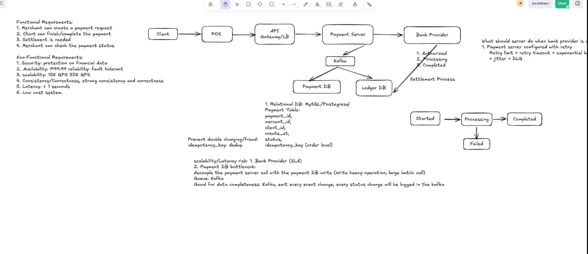

# Payment System - Offline method

A **runnable** implementation of the design diagram. It models the Payment
Server, Bank Provider, Kafka, Payment DB, Ledger DB and the Settlement Process
with in-memory mock data — no external middleware required. `pip install` and run.



## Design diagram → code


| Element in the diagram                                                | Implementation                                                                      |
| --------------------------------------------------------------------- | ----------------------------------------------------------------------------------- |
| API Gateway / LB + Payment Server                                     | `app/main.py` (FastAPI routes) + `app/payment_service.py` (core logic)              |
| Bank Provider (Authorized→Processing→Completed, SLA/timeout/outage) | `app/bank_provider.py` (mock, per-client failure scenarios)                         |
| Kafka (emit every status change; decouple DB writes)                  | `app/event_bus.py` (each consumer gets its own queue+thread, like a consumer group) |
| Payment DB (payment table, unique idempotency_key)                    | `app/db.py: PaymentDB`                                                              |
| Ledger DB (double-entry)                                              | `app/db.py: LedgerDB` + `app/ledger.py`                                             |
| Settlement Process (FR3)                                              | `app/settlement.py: SettlementProcessor`                                            |
| State machine Started→Processing→Completed/Failed                   | `app/models.py` (`ALLOWED_TRANSITIONS`, strictly enforced)                          |
| Retry: limit + timeout + exponential backoff + jitter + DLQ           | `app/retry.py` + event-bus DLQ                                                      |
| Idempotency key to prevent double charging                            | `PaymentDB` unique index + dedup in `create_payment`                                |

## Functional requirements (FR) covered

- **FR1 Merchant creates a payment request** → `POST /v1/payments` (idempotent on `idempotency_key`)
- **FR2 Client completes the payment** → `POST /v1/payments/{id}/complete` (state machine + bank retry)
- **FR3 Settlement** → `POST /v1/settlements/run` (net per-merchant payout batches)
- **FR4 Merchant checks status** → `GET /v1/payments/{id}`

## How the non-functional requirements show up

- **Consistency / correctness**: only legal state transitions are allowed; money is stored in integer minor units (cents); the double-entry ledger always balances (debits == credits).
- **Anti-double-charge / idempotency**: `(merchant_id, idempotency_key)` is unique; a duplicate create returns the original payment; a duplicate complete is a no-op.
- **Availability / fault tolerance**: the bank call retries transient failures with exponential backoff + jitter; once retries are exhausted the message goes to the DLQ and the payment is marked FAILED, so the main flow never hangs.
- **Scalability / latency**: the Payment Server only synchronously writes the Payment DB (the source of truth); the ledger and settlement run as async Kafka consumers, decoupling the write-heavy / batch work from the hot path.

## Requirements

Python **3.9+**. Dependencies are listed in `requirements.txt`.

## Quick start (local)

```bash
cd payment-system
python3 -m venv .venv          # create an isolated virtual environment
source .venv/bin/activate      # activate it (Windows: .venv\Scripts\activate)
pip install -r requirements.txt
uvicorn app.main:app --reload  # then open http://127.0.0.1:8000/
```

Once activated, your prompt shows `(.venv)` and `pip` / `python` / `uvicorn`
resolve correctly. Stop the server with `Ctrl+C`; leave the environment with
`deactivate`.

## Run

```bash
pip install -r requirements.txt

# ★ Real-time dashboard (recommended): start the server, open it in a browser
uvicorn app.main:app --reload
# then visit http://127.0.0.1:8000/
#   Top:    connection status + counters (Requests / In flight / Completed / Failed / DLQ)
#   Left:   create a payment request; each payment's state-machine rail lights up live
#   Right:  Kafka event stream (terminal-style ticker) + DLQ dead letters
#   Bottom: double-entry ledger (debits == credits) + settlement batches
#   Buttons: Complete payment / Complete all pending / Run settlement / Reset
# API docs are also at http://127.0.0.1:8000/docs

# One-shot command-line demo (no browser)
python demo.py

# Tests
pytest -q
```

### How the dashboard is "real-time"

The backend streams every event from the bus over **SSE (Server-Sent Events)** at
`GET /v1/stream`. Every status change (`payment.started/processing/completed/failed`)
appears in the stream instantly and animates the matching payment's state-machine
rail. To make the `PROCESSING` step visible to the eye, the server bumps the mock
bank latency to 0.25–0.6s (`_BANK_LATENCY` in `app/main.py`, tune freely). Pick
`c_bob` to watch retry backoff; pick `c_erin` to watch retries exhaust into the DLQ.

## Mock client scenarios (used to cover every branch)


| client  | scenario                  | result                             |
| ------- | ------------------------- | ---------------------------------- |
| c_alice | normal                    | succeeds first try                 |
| c_bob   | first 2 calls return 503  | succeeds after retry (attempts=3)  |
| c_carol | first call times out      | succeeds after retry               |
| c_dave  | hard decline              | FAILED,**no retry**                |
| c_erin  | provider keeps timing out | retries exhausted → DLQ → FAILED |

## API quick reference

```
POST /v1/payments                 create a payment request (idempotent)
POST /v1/payments/{id}/complete   complete a payment
GET  /v1/payments/{id}            get one payment
GET  /v1/payments?merchant_id=    list a merchant's payments
POST /v1/settlements/run          run settlement
GET  /v1/settlements              list settlement batches
GET  /v1/ledger?payment_id=       ledger entries
GET  /v1/events                   Kafka event log + DLQ
GET  /v1/reference                mock merchants / clients
GET  /                            real-time dashboard
GET  /v1/stream                   SSE live event stream
GET  /v1/snapshot                 full current state (dashboard boot)
POST /v1/reset                    rebuild + reseed mock data
```

## Notes

All data lives in memory and is cleared on restart — this is an architecture-focused
mock, not production code. To productionize, swap `PaymentDB/LedgerDB` for real
MySQL/Postgres, `EventBus` for real Kafka, and `BankProvider` for a real bank /
payment channel; the business-logic layer stays essentially unchanged.

A simple fee model (2.9% + 30 cents) is included to make settlement realistic;
remove it in `app/ledger.py` if you don't need it.
